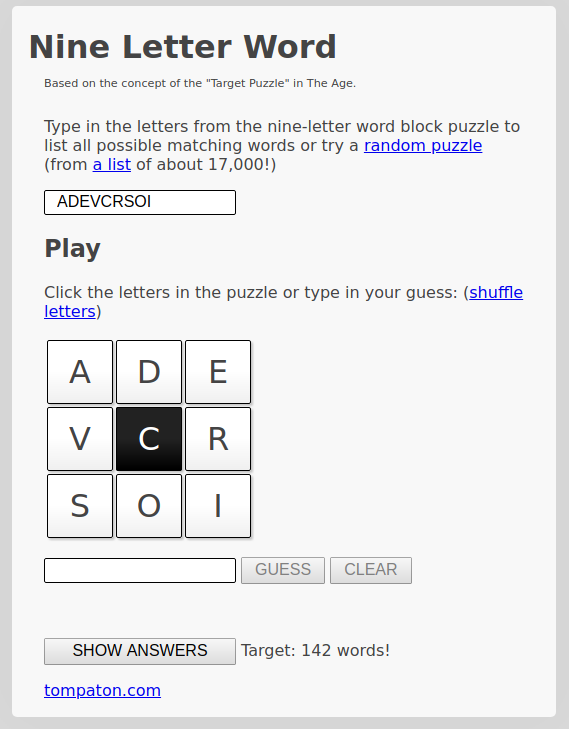

# Word Puzzle Python Solver

This is a Python implementation of the 9-letter word puzzle:

- [Nine Letter Word](http://nineletterword.tompaton.com/adevcrsoi/)
- [Your Word Life](http://www.yourwiselife.com.au/games/9-letter-word/)



Here we are using a subset of the British dictionary from the
[wbritish](https://packages.debian.org/sid/text/wbritish) package.

## Quick Start

To show program options call the program with the `-h` option:

```bash
uv run python wordpuzzle.py -h
```

Find all dictionary words of length 8 or more using the letters `cadevrsoi`:

```bash
$ ./wordpuzzle.py -s 8 -l cadevrsoi
codrives
covaried
covaries
discover
divorces
idocrase
varicose
varicosed
```

## Tools Used

The tools required to build and test this project are managed via
[uv](https://docs.astral.sh/uv/) and defined in
[pyproject.toml](./pyproject.toml):

- [hypothesis](https://hypothesis.readthedocs.io/) - [QuickCheck](https://en.wikipedia.org/wiki/QuickCheck) style testing framework
- [pytest](https://docs.pytest.org/) - unit tests including [test coverage](https://pytest-cov.readthedocs.io/en/latest/)
- [ruff](https://github.com/astral-sh/ruff) - format and lint source files
- [uv](https://docs.astral.sh/uv/) - manage this project's environment

## Dictionary

This project requires a dictionary of valid words. By default the project uses a
subset of the British dictionary from
[wbritish-huge](http://wordlist.sourceforge.net/). Since this is a large file,
and we need at most 9-letter words, we can create a smaller dictionary using:

```bash
egrep '^[[:lower:]]{1,9}$' /usr/share/dict/british-english-huge > dictionary
```

## Environment Setup

To initialise the development environment:

```bash
uv sync
```

This creates a virtual environment and installs all dependencies from
[pyproject.toml](./pyproject.toml).

## Dependent Packages

List installed packages:

```bash
uv pip list
```

## Format

To format code using [ruff](https://github.com/astral-sh/ruff):

```bash
uv run ruff format *.py library/*.py tests/*.py
```

## Lint

Lint source files using [ruff](https://github.com/astral-sh/ruff):

```bash
uv run ruff check *.py library/*.py tests/*.py
```

## Test

Test using [PyTest](https://docs.pytest.org/):

```bash
uv run pytest -v --cov-report term-missing --cov=library tests
```

## Run

Run application with:

```bash
uv run python wordpuzzle.py -s 7 -l cadevrsoi
```

## Documentation

Get [pydoc](https://docs.python.org/3/library/pydoc.html) using:

```bash
pydoc wordpuzzle
pydoc library.filters
```

## Build and run from Docker

To run using my Docker image first install the default dictionary:

```bash
curl https://raw.githubusercontent.com/dwyl/english-words/master/words.txt -o dictionary
```

Then call the application using GNU make:

```bash
docker run --rm -t -v $PWD:/opt/workspace -u $(id -u):$(id -g) frankhjung/python:latest make exec
```

This will call the `exec` goal, which executes the application using the default
dictionary.

## Partial functions

In an older commit,
[4c3e0acf](https://gitlab.com/frankhjung1/python-wordpuzzle/-/tree/4c3e0acff3dd603737fc0b6914d98824b1e11a4e),
[wordpuzzle](./wordpuzzle.py) used a partial function to validate the letters
argument. There is an easier, more direct way to do this.

```python
from functools import partial

def arg_test(arg_test_func, param):
    '''Test if valid argument.

    Args:
        arg_test_func (func): Function to test argument
        param : Argument to test

    Returns:
        param : the validated argument

    Raises:
        ArgumentTypeError : if argument invalid
    '''
    if not arg_test_func(param):
        raise argparse.ArgumentTypeError(f"{param} invalid value")

    return param

#: Validate letters argument
arg_letters = partial(arg_test, is_valid_letters)

# Used by argparse argument declaration:
PARSER.add_argument(
    '-l',
    '--letters',
    help='letters to create words from (mandatory is first letter)',
    type=arg_letters,
    required=True,
)
```

## Updating Packages

Update outdated packages by editing [pyproject.toml](./pyproject.toml) and
running:

```bash
uv sync
```

## References

- [Hypothesis](https://hypothesis.works/)
- [Pytest](https://docs.pytest.org/)
- [Python 3 Tutorial](https://docs.python.org/3/tutorial/)
- [Python Code Style](https://github.com/google/styleguide/blob/gh-pages/pyguide.md)
- [uv](https://docs.astral.sh/uv/)

## Other Implementations

- [Clojure](https://gitlab.com/frankhjung1/clojure-wordpuzzle)
- [Haskell](https://gitlab.com/frankhjung1/haskell-wordpuzzle)
- [Java](https://gitlab.com/frankhjung1/java-wordpuzzle)
- [Kotlin](https://gitlab.com/frankhjung1/kotlin-wordpuzzle)
- [Go](https://gitlab.com/frankhjung1/go-wordpuzzle)
- [Python](https://gitlab.com/frankhjung1/python-wordpuzzle)

## LICENSE

[GNU GPLv3 LICENSE](./LICENSE)
